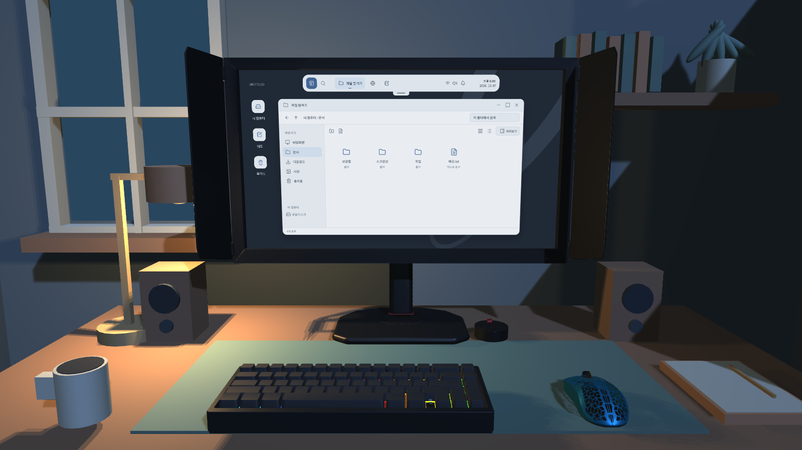

# PR GAME

Unity로 만드는 개인 소개 탐색 게임. 책상 앞에서 모니터를 바라보는 고정 시점으로, 모니터 안의 가상 운영체제에서 폴더와 파일을 찾아 취향과 작업물을 알아간다.

## 실행

- Unity **6000.6.0f1**로 이 폴더를 연다.
- `Assets/Scenes/Desktop3D.unity`를 열고 Play를 누른다.
- 상단 아일랜드에서 시작 메뉴, 통합 검색, 파일 탐색기, 브라우저, 메모를 연다. 설정에서 실버+블루 / 차콜+세이지 테마를 선택한다.
- 창의 제목 표시줄을 끌어 이동하고 가장자리·모서리로 크기를 조절한다. 제목 표시줄 더블클릭은 최대화/복원, `Ctrl+Alt+←/→`는 좌우 정렬이다. 최대화하면 상단 바가 숨고 손잡이로 다시 꺼낼 수 있다.
- 파일은 더블클릭으로 연다. 우클릭 메뉴로 이름 변경·복사·삭제하고 휴지통에서 복원한다. 사용자가 만든 파일도 검색된다.
- 메모는 자동 저장된다. **파일로 저장** 버튼 또는 `Ctrl+Shift+S`로 이름과 저장 폴더를 선택해 `.txt` 파일을 만들 수 있다. `Ctrl+S`는 현재 메모를 저장한다.
- 모니터 위 우클릭은 OS 메뉴로 작동한다. `Alt+오른쪽 마우스`를 누른 채 움직이면 주변을 둘러본다. 모니터 밖에서는 오른쪽 마우스만으로도 둘러볼 수 있다. `F` 집중 보기, `Home` 정면 복귀, `H` 분위기 효과. 글을 입력하는 동안 F/H/Home은 카메라를 움직이지 않는다.
- 브라우저의 탭·주소 입력·방문 기록·북마크는 게임 내부 페이지용이다. Chromium 엔진이나 외부 웹 연결은 포함하지 않는다. 게임 진행·단서는 아직 넣지 않았다.

## 확정 방향

- 실제 3D 작업실에서 책상 앞에 앉아 모니터를 바라보는 시점. Start Survey?의 구도를 참고한다.
- 가벼운 긴장감은 느린 조명 변화로 표현하며 끌 수 있다. 점프 스케어나 추격은 구현하지 않았다.
- 탐색은 모니터 안에서 진행. 정해진 순서, 탈출 목표, 엔딩 없음.
- 취향과 작업물은 추후 파일과 검색 기록을 탐색하며 알아가는 방향이다. 직접적인 자기소개 목록은 현재 OS에서 제외했다.
- OS 사용자 이름은 조건희. 플레이어 메모는 게임 내 가상 파일이며 실제 컴퓨터의 문서 폴더와 분리한다.

## 개발 관리

`Assets`와 `.meta`, `Packages`, `ProjectSettings`, 문서를 함께 커밋한다. `Library`, `Temp`, `Logs`, 빌드 결과물과 개인 설정은 제외한다. 외부 음악, 상업 게임 이미지 및 다른 프로젝트의 원본 에셋은 포함하지 않았다.

기획 및 다음 작업은 [Docs/DEVELOPMENT.md](Docs/DEVELOPMENT.md)에 기록한다.

저장 위치는 `Application.persistentDataPath/Desktop/session-v1.json`이다. 임시 파일에 먼저 쓴 뒤 교체하고 이전 저장은 `.bak`으로 보관한다. 파일, 메모, 테마, 방문 기록, 북마크와 방해 금지 설정이 유지된다. OS 아이콘은 [Lucide](https://lucide.dev/)이며 라이선스는 `Assets/Resources/Desktop/Icons/LICENSE.txt`, 한글 폰트 라이선스는 `Assets/Resources/Fonts/OFL.txt`에 있다.

[메모 파일 저장 화면](Docs/Images/unity-os-save-file.png) · [동작 검증 결과](Docs/os-verification.txt)

모니터·블랙 키보드·블루 타공 마우스는 Blender MCP로 제작해 3D 씬에 배치했다. 수정 가능한 원본과 제작 스크립트는 [ArtSource/Blender](ArtSource/Blender), Unity용 모델과 재질은 [Assets/Art/ReferenceProps](Assets/Art/ReferenceProps)에 있다. [현재 책상 화면](ArtSource/Blender/Models/unity-desk.png)에서 배치를 확인할 수 있다.
