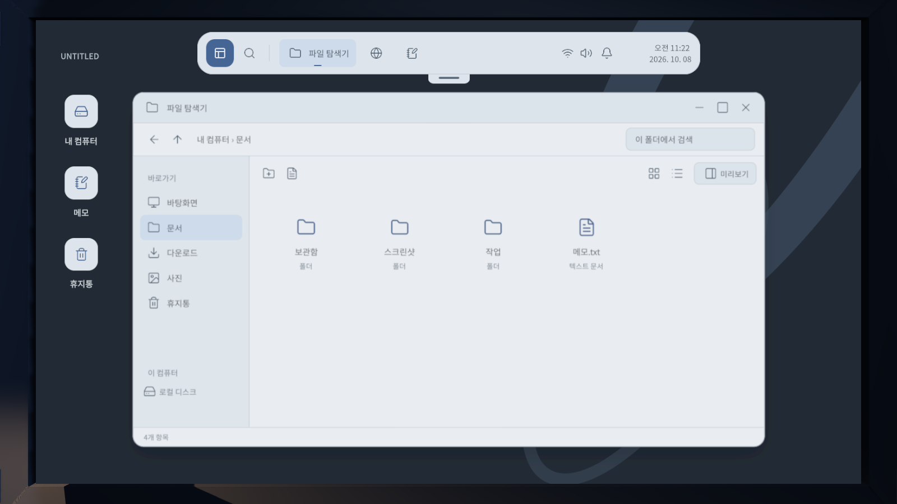

# PR GAME

Unity로 만드는 개인 소개 탐색 게임. 심야 방에서 주변을 둘러보고, 컴퓨터를 사용할 때 모니터 앞으로 다가가 가상 운영체제의 폴더와 파일을 탐색한다.

## 실행

- Unity **6000.6.0f1**로 이 폴더를 연다.
- `Assets/Scenes/Desktop3D.unity`를 열고 Play를 누른다.
- 상단 아일랜드에서 시작 메뉴, 통합 검색, 파일 탐색기, 브라우저, 메모를 연다. 설정에서 실버+블루 / 차콜+세이지 테마를 선택한다.
- 창의 제목 표시줄을 끌어 이동하고 가장자리·모서리로 크기를 조절한다. 제목 표시줄 더블클릭은 최대화/복원, `Ctrl+Alt+←/→`는 좌우 정렬이다. 최대화하면 상단 바가 숨고 손잡이로 다시 꺼낼 수 있다.
- 바탕화면과 탐색기의 파일은 한 번 클릭해 선택하고 더블클릭 또는 Enter로 연다. 텍스트 파일은 메모, 폴더는 탐색기로 연결된다. 파일을 옮기거나 이름을 바꿔도 저장 위치와 내용이 유지되며, 메모 하단에 현재 파일 경로를 표시한다. 우클릭 메뉴로 열기·이름 변경·복사·삭제하고 휴지통에서 복원한다. 사용자가 만든 파일도 검색된다.
- 메모는 자동 저장된다. **파일로 저장** 버튼 또는 `Ctrl+Shift+S`로 이름과 저장 폴더를 선택해 `.txt` 파일을 만들 수 있다. `Ctrl+S`는 현재 메모를 저장한다.
- 처음에는 방을 보는 상태다. 마우스를 움직이면 의자에 앉은 위치에서 360도 둘러본다. **우클릭을 누르는 동안** 바라보는 곳을 부드럽게 확대하고, 놓으면 원래 시야로 돌아온다. 확대 중에는 마우스 감도도 낮아진다. 화면 중앙으로 모니터를 보고 클릭하거나 `F`를 누르면 컴퓨터에 다가간다. **OS 표시 영역 자체**가 16:9 화면의 가로·세로 92%, 전체 면적 약 85%를 채운다. 베젤과 가림막은 이 비율에 포함하지 않는다. 다른 종횡비에서는 OS가 잘리지 않도록 더 제한되는 방향을 92%로 맞춘다.
- 방의 문을 화면 중앙으로 보고 클릭하면 부드럽게 여닫힌다. 경첩을 뒤쪽으로 옮겨 앉은 자리에서 열린 문 너머를 볼 수 있고 손잡이는 문과 함께 움직인다.
- 컴퓨터를 조작하는 동안 카메라는 고정되고 우클릭은 OS 메뉴로 작동한다. `Esc`로 방 보기로 돌아간다. 방에서 `Esc`를 누르거나 앱 포커스를 잃으면 마우스를 해제하며, 화면을 다시 클릭하면 둘러보기를 재개한다. 재개 클릭은 모니터 진입으로 이어지지 않는다. `Home`은 정면 복귀, `H`는 느린 조명 변화 토글이다. 글을 입력하는 동안 F/H/Home은 카메라를 움직이지 않는다. 방을 보는 동안에는 OS 입력을 막고 열어 둔 창과 메모는 유지한다.
- OS 전용 커서는 컴퓨터 접근이 끝난 뒤 모니터 화면 안에서만 표시한다. 밝은 화살표에 테마별 블루/세이지 포인트를 넣었고 버튼·텍스트 입력·창 이동·8방향 크기 조절에 맞춰 모양이 바뀐다. 방 보기, 화면 바깥, 앱 포커스 상실 시 숨기며 기본 마우스 커서가 겹치지 않도록 관리한다. [실행 화면](Docs/Images/unity-os-cursor.png) · [커서 검증](Docs/cursor-verification.txt)
- 브라우저는 Windows용 무료 CEF 엔진으로 실제 인터넷에 연결된다. 주소나 검색어 입력, 클릭·스크롤·한글 입력 전달, 독립 탭, 뒤로·앞으로·새로고침, 방문 기록·북마크를 지원한다. 문서·보관함은 게임 내부 페이지로 유지한다. 새로 저장소를 받았다면 [무료 웹 엔진 준비 안내](Docs/BROWSER.md)를 따른다. 게임 진행·단서는 아직 넣지 않았다.

## 확정 방향

- 실제 3D 작업실에서 책상 앞에 앉아 모니터를 바라보는 시점. Start Survey?의 구도를 참고한다.
- 가벼운 긴장감은 느린 조명 변화로 표현하며 끌 수 있다. 점프 스케어나 추격은 구현하지 않았다.
- 모니터 조작과 방 둘러보기를 전환한다. 현재 이동 방식은 의자에 앉은 시점이며 보행은 아직 없다. 정해진 순서, 탈출 목표, 엔딩 없음.
- 취향과 작업물은 추후 파일과 검색 기록을 탐색하며 알아가는 방향이다. 직접적인 자기소개 목록은 현재 OS에서 제외했다.
- OS 사용자 이름은 조건희. 플레이어 메모는 게임 내 가상 파일이며 실제 컴퓨터의 문서 폴더와 분리한다.

## 개발 관리

`Assets`와 `.meta`, `Packages`, `ProjectSettings`, 문서를 함께 커밋한다. `Library`, `Temp`, `Logs`, 빌드 결과물과 개인 설정은 제외한다. 외부 음악, 상업 게임 이미지 및 다른 프로젝트의 원본 에셋은 포함하지 않았다.

기획 및 다음 작업은 [Docs/DEVELOPMENT.md](Docs/DEVELOPMENT.md)에 기록한다.

저장 위치는 `Application.persistentDataPath/Desktop/session-v1.json`이다. 임시 파일에 먼저 쓴 뒤 교체하고 이전 저장은 `.bak`으로 보관한다. 파일, 메모, 테마, 방문 기록, 북마크와 방해 금지 설정이 유지된다. OS 아이콘은 [Lucide](https://lucide.dev/)이며 라이선스는 `Assets/Resources/Desktop/Icons/LICENSE.txt`, 한글 폰트 라이선스는 `Assets/Resources/Fonts/OFL.txt`에 있다.

방은 사용자 평면도를 따른다. 책상 왼쪽은 냉장고, 오른쪽은 옷장, 책상 기준 오른쪽 벽은 창문이다. 뒤쪽 오른편에는 가로로 놓인 침대, 뒤쪽 왼편에는 출입문과 옷걸이가 있다. 의자는 T50 참고 모델이다. [위에서 본 배치](Docs/Images/unity-room-plan.png) · [오른쪽 창문과 침대](Docs/Images/unity-room-right-wall.png)

PBR 재질, 부드러운 실시간 그림자, 구운 간접광, 반사 프로브와 접촉 음영을 적용했다. 텍스처 출처는 [Poly Haven CC0 자원 목록](Assets/Art/Room/SOURCES.md)에 기록했다. [방과 카메라 검증](Docs/room-verification.txt)

장패드는 제거하고 마우스 아래에만 펄사 새턴 프로 레드를 참고한 49 × 42cm 패드를 배치했다. 키보드는 책상에 직접 놓이며 노트와 펜은 패드 옆에 정리했다. 문과 패드 변경은 Play 시작 시 적용된다. [책상 화면](Docs/Images/unity-red-mousepad.png) · [앉은 자리에서 열린 문](Docs/Images/unity-door-open.png) · [소품 검증](Docs/room-props-verification.txt)

[메모 파일 저장 화면](Docs/Images/unity-os-save-file.png) · [동작 검증 결과](Docs/os-verification.txt)

[저장한 파일 다시 열기](Docs/Images/unity-os-file-opened.png) · [파일 연결 검증](Docs/file-activation-verification.txt)

모니터·블랙 키보드·블루 타공 마우스는 Blender MCP로 제작해 3D 씬에 배치했다. 수정 가능한 원본과 제작 스크립트는 [ArtSource/Blender](ArtSource/Blender), Unity용 모델과 재질은 [Assets/Art/ReferenceProps](Assets/Art/ReferenceProps)에 있다. [현재 책상 화면](ArtSource/Blender/Models/unity-desk.png)에서 배치를 확인할 수 있다.
